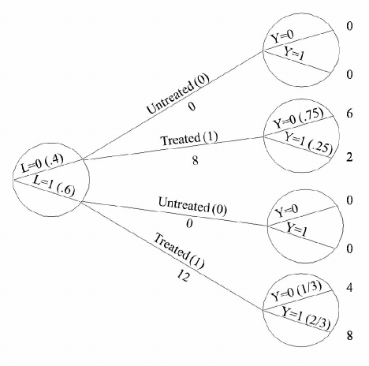

```{r setup, include=FALSE, message = FALSE}
knitr::opts_chunk$set(echo = FALSE)
# xaringan::summon_remark(version = "latest", to = "libs/")
library(data.table)
library(ptree)
library(ggplot2)
```

## Recap ...

.pull-left[
$$
\begin{aligned}
A, Y
\end{aligned}
$$
]
.pull-right[
+ **Treatment and outcome**
random variables for treatment and outcome
]

--

.pull-left[
$$
\begin{aligned}
Y^{a = 1}, Y^{a = 0}  
\end{aligned}
$$
]
.pull-right[
+ **Counterfactual/Potential outcome**;
outcome that would have been observed under treatment value $a$ - one outcome is realised, assumes no *interference*
]

--

.pull-left[
$$
\begin{aligned}
Y^{a = 1} \ne Y^{a = 0}
\end{aligned}
$$
]
.pull-right[
+ **Causal effect for individual** implied but not identifiable
]

--

.pull-left[
$$
\begin{aligned}
Y = Y^A
\end{aligned}
$$
]
.pull-right[
+ **Consistency**; if $A_i = a$ then $Y$ equal to potential outcome $Y_i^a = Y_i^A = Y_i$
]

---
class: left, top
## Recap ...

.pull-left[
$$
\begin{aligned}
A = a
\end{aligned}
$$
]
.pull-right[
+ **SUTVA**;
stable-unit-treatment-value - one version of treatment 
]

--

.pull-left[
$$
\begin{aligned}
E(Y^{a = 1}) \ne E(Y^{a = 0})
\end{aligned}
$$
]
.pull-right[
+ **ACE**;
avg causal effects for specified outcome of interest and treatments for a well defined population
]

--

.pull-left[
$$
\begin{aligned}
P(Y=1|A=1) &= P(Y=1|A=0)
\end{aligned}
$$
]
.pull-right[
+ **Independence**;
$Y \perp A$
]

--

.pull-left[
$$
\begin{aligned}
&E[Y|A=1] \text{ vs. } E[Y|A=0] \\
&E[Y^{a=1}] \text{ vs. } E[Y^{a=0}] 
\end{aligned}
$$
]
.pull-right[
+ **Association vs Causation**;
difference in risk in population determined by actual treatment vs difference in risk under two different treatment values
]

--

+ Under what conditions can real world data be used for causal inference?

---
class: left, top
## Randomized experiments

Randomized experiments address the main components of any causal question:

--

+ Does an action,

--

+ affect an outcome,

--

+ in a specific population?

---
class: left, top
### Randomisation

+ Interested in potential outcomes $Y^{a=1}$ and $Y^{a=0}$

--

+ Only see $Y$ under the treatment $A$ that participant received

--

+ In other words, a missing data problem

--

+ Randomisation ensures missing values occurred by chance

--

+ Expected to produce **exchangeability**

---
class: left, top
### Exchangeability

+ Counterfactual outcome and actual treatment are independent; $Y^a \perp A$ for all $a$

--

+ What?

--

+ Doesn't matter which group is assigned to treatment and which group is assigned to control

--

+ Counterfactual outcome $Y^a$ is a fixed characteristic (like genetic makeup) existing before treatment was randomly assigned

--

+ $Y^a$ encodes the outcome when assigned to $a$

--

+ If $A$ is randomised, then is independent of your fixed counterfactual $Y^a$

--

+ $\implies$ association equivalent to causation

---
class: left, top
### Exchangeability

A randomised experiment **implies exchangeability**, $Y^a \perp A$, but if there is a treatment effect, then $Y \perp A$ **does not hold** because treatment is assoc with observed outcome.

+ $Y^a \perp A$ and $Y \perp A$ are different things

--

+ $Y^a \perp A$ - independence between **counterfactual** and observed treatment

--

+ $Y \perp A$ - independence between the **observed outcome** and the observed treatment

--

+ Equal risk under no treatment (and treatment) in the treated and untreated groups implies exchangeable

$$
\begin{aligned}
P(Y^{a} = 1 | A=1) = P(Y^{a} = 1 | A=0) \quad \forall a \implies \text{exchangeable}
\end{aligned}
$$

--

+ Infeasible to test IRL because no counterfactual available to us

--

+ Assumption gives us equivalence of association and causality

```{r, echo = FALSE, eval = FALSE}
tbl1_1 <- data.table()
tbl1_1$name <- c(
  "Rheia",  "Kronos",  "Demeter",  "Hades",  "Hestia",
  "Poseidon",  "Hera",  "Zeus",  "Artemis",  "Apollo",
  "Leto",  "Ares",  "Athena",  "Hephaestus",  "Aphrodite",
  "Cyclope",  "Persephone",  "Hermes",  "Hebe",  "Dionysus"
)
tbl1_1$A   <- c(0,0,0,0,1,1,1,1,0,0,0,1,1,1,1,1,1,1,1,1)
tbl1_1$Y   <- c(0,1,0,0,0,0,0,1,1,1,0,1,1,1,1,1,1,0,0,0)
tbl1_1$Y0  <- c(0,1,0,0,NA,NA,NA,NA,1,1,0,NA,NA,NA,NA,NA,NA,NA,NA,NA)
tbl1_1$Y1  <- c(NA,NA,NA,NA,0,0,0,1,NA,NA,NA,1,1,1,1,1,1,0,0,0)

tbl1_1$YY0 <- c(0,1,0,0,0,1,0,0,1,1,0,1,1,0,0,0,1,1,1,1)
tbl1_1$YY1 <- c(1,0,0,0,0,0,0,1,1,0,1,1,1,1,1,1,1,0,0,0)

# Start with a = 0
# risk of death under no treatment in the 7 untreated
# risk of death under no treatment in the 13 treated
# Pr[Y^{a=0}=1 | A = 0]
# Pr[Y^{a=0}=1 | A = 1]
tbl1_1[A == 0, ]
tbl1_1[A == 1, ]
tbl1_1[, .(.N, Y = sum(YY0), P = mean(YY0)), by = .(A)]
```

---
class: left, top
### Conditional randomisation

+ Previously considered **marginally randomised** experiment

--

+ Stratified randomisation $\implies$ **conditionally randomised** experiments

--

+ Conditionally randomisation leads to conditional exchangeability $Y^a \perp A | L$

--

+ Observed risks are equal to the counterfactual risks within $L$

---
class: left, top
### Standarisation

+ Average causal effect derived from weighting the within $L$ effect estimates

--

+ Marginal counterfactual risk $P(Y^a = 1)$ is the weighted average of the stratum-specific risks $P(Y^a = 1|L=0)$ and $P(Y^a = 1|L=1)$ with weights equal to proportion of individuals in population with $L=0$ and $L=1$

$$
\begin{aligned}
P(Y^a = 1) = \sum_l P(Y^a = 1|L = l)P(L=l)
\end{aligned}
$$

---
class: left, top
### Inverse probability weighting

+ Mathematically equivalent to standardisation

--

+ Based on the observed data:

.pull-left[
$$
\begin{aligned}
&P(L=0) = 0.4 \\
&P(A=0|L=0)=0.5 \\
&P(Y=0|A=0, L=0) = 0.75 \quad \text {etc.}
\end{aligned}
$$
]
.pull-right[
```{r out.width = "100%", eval=TRUE}

```
]

+ Used to create the causal risk ratio

---
class: left, top
### Inverse probability weighting

+ Under conditional exchangeability, simulate counterfactuals 

--

.pull-left[
```{r out.width = "90%", eval=TRUE}

```
Population with all untreated (10 die) gives $P(Y^{a=0}=1)$ 
]

--

.pull-right[
```{r out.width = "90%", eval=TRUE}

```
Population with all treated (10 die) gives $P(Y^{a=1}=1)$
]

--

+ Causal risk ratio: $P(Y^{a=1}=1)/P(Y^{a=0}=1) = 1$

--

+ Weights arise from $1/f(A|L)$; one over the conditional probability of treatment

---
class: left, top
### Summary

+ Randomisation allows us to assume exchangeability

--

+ Exchangeability allows us to infer the causal effects 

--

+ Potential outcome independent of treatment

--

+ Stratified randomisation leads to conditional exchangeability

--

+ Standardization uses the probability of the strata and the
conditional probability of outcome given treatment and strata membership

--

+ IP weighting uses the conditional probability of treatment given the covariate 

